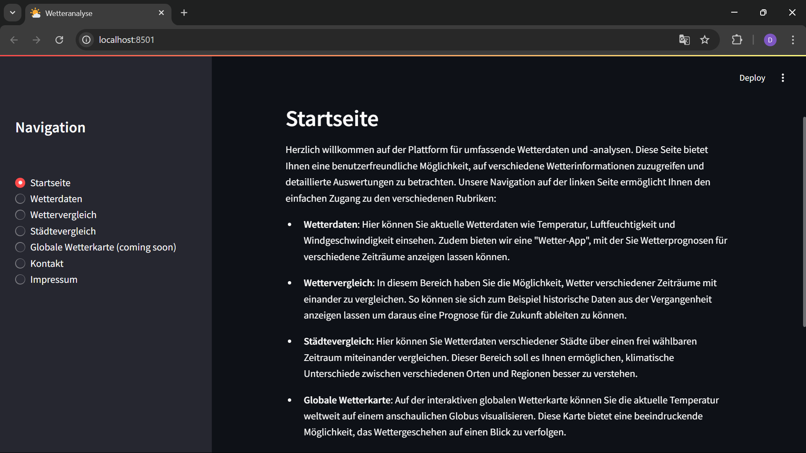

# Wetteranalyse - Praxisprojekt Datenvisualisierung

## Übersicht
Dies ist eine Wetteranalyse-Plattform, die verschiedene Wetterinformationen und -prognosen für ausgewählte Städte anzeigt.
Die Anwendung bietet eine benutzerfreundliche Oberfläche, mit der Benutzer auf Wetterdaten zugreifen, Wettervorhersagen
anzeigen und verschiedene Wetterparameter in einem benutzerdefinierten Zeitraum untersuchen können. Die Daten werden
durch APIs abgerufen und visualisiert.

## Funktionen
- **Startseite**: Einführung und Navigation zur verschiedenen Wetterdiensten.
- **Wetterdaten**: Zeigt das aktuelle Wetter, 3-Stunden-Intervall-Daten, Wettervorhersage für die nächsten 5 und 16 Tage
 sowie benutzerdefinierte Zeiträume.
- **Wettervergleich**: Vergleich von Wetterdaten für verschiedene Zeiträume.
- **Städtevergleich**: Vergleiche von Wetterdaten für verschiedene Städte.
- **Globale Wetterkarte**: (Kommt bald) Eine interaktive Karte zur Visualisierung globaler Wetterdaten.
- **Kontakt**: Formular, um mit dem Betreiber der Seite in Kontakt zu treten.
- **Impressum**: Rechtliche Informationen.

## Installation

1. **Voraussetzungen**:
   - Python 3.x
   - Streamlit
   - Pandas
   - Matplotlib

2. **Installation der Abhängigkeiten**:
   pip install -r requirements.txt
   

3. **Ausführen der Anwendung**:
   Starte die Anwendung mit folgendem Befehl:
   - streamlit run main.py
   

## Funktionsweise

### Wetterdaten:
Der Benutzer kann eine Stadt eingeben und zwischen verschiedenen Wetterabfragen wählen z.B:
- Aktuelles Wetter
- Wettervorhersage für die nächsten 3 Stunden
- Wettervorhersage für die nächsten 5 oder 16 Tage
- Wetterdaten für einen benutzerdefinierten Zeitraum

Die Wetterdaten werden durch API-Abfragen abgerufen (z.B. OpenWeather API).

### Visualisierung:
Die Daten werden in verschiedenen Diagrammen angezeigt:
- Temperatur (in °C)
- Luftfeuchtigkeit (in %)
- Windgeschwindigkeit (in m/s)

Die Diagramme sind interaktiv und passen sich den gewählten Daten und Zeiträumen an.

### Benutzerdefinierter Zeitraum:
Benutzer können Start- und Enddatum eingeben, um Wetterdaten für einen benutzerdefinierten Zeitraum zu erhalten.

Nach der Auswahl wird der entsprechende Zeitraum angezeigt und in einem Diagramm visualisiert.

## APIs

Die Wetterdaten werden über die OpenWeather-API abgerufen. Die folgenden Endpunkte werden verwendet:
- **Aktuelles Wetter**: Abruf der aktuellen Wetterdaten für eine Stadt.
- **Wettervorhersage**: Abruf von Wettervorhersagen für die nächsten 3 Stunden, 5 Tage und 16 Tage.

API-Dokumentation: [OpenWeather API](https://openweathermap.org/api)

### Funktionen:
- `fetch_current_weather(city)`: Ruft die aktuellen Wetterdaten für eine angegebene Stadt ab.
- `fetch_5d_forecast(city)`: Ruft die Wettervorhersage für die nächsten 5 Tage ab.
- `fetch_16d_forecast(city)`: Ruft die Wettervorhersage für die nächsten 16 Tage ab.
- `get_emoji_for_weather()`: Gibt Emojis basierend auf den Wetterbedingungen zurück.

## Diagramme
Die Wetterdaten werden in verschiedenen Diagrammtypen angezeigt:
- **Temperatur-Diagramm**: Liniendiagramm für Temperatur (in °C).
- **Luftfeuchtigkeit-Diagramm**: Balkendiagramm für Luftfeuchtigkeit (in %).
- **Windgeschwindigkeit-Diagramm**: Bereichsdiagramm für Windgeschwindigkeit (in m/s).

## Kontakt
Für Fragen und Anregungen können Sie uns über https://github.com/Ameroras erreichen 

## Lizenz
Dieses Projekt ist unter der MIT-Lizenz lizenziert.

Viel Spaß beim Erkunden der Wetterdaten!
